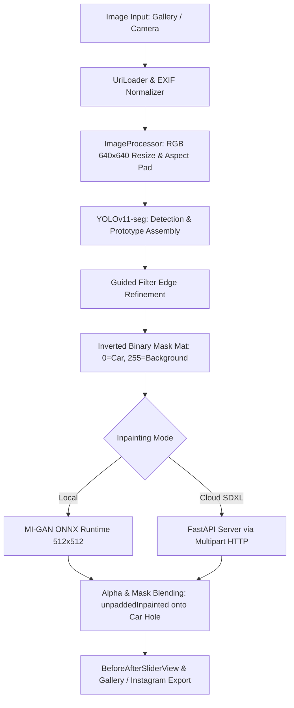

# AutoKorrektur — Architecture & System Specification

This document defines the core architecture, dataflow pipelines, matrix conventions, coordinate spaces, and resource management protocols across the AutoKorrektur project.

---

## 1. System Overview

AutoKorrektur employs a **hybrid on-device and cloud machine learning architecture**:
- **On-Device (Default)**: Zero-network, privacy-preserving pipeline combining YOLOv11-seg (TFLite) instance segmentation with MI-GAN (ONNX Runtime) local neural inpainting.
- **Cloud Backend (Premium)**: Remote FastAPI backend orchestrating PyTorch Stable Diffusion inpainting with memory-only GDPR guarantees and Google Play Integrity attestation.

---

## 2. Mask Polarity & Value Conventions

> [!IMPORTANT]
> **Strict Mask Polarity Rule**:
> - **Value `0` (Black)**: Represents the **vehicle / hole to be inpainted**.
> - **Value `255` (White)**: Represents the **background / context to be preserved**.

### Component Polarity Contract
| Stage / Component | Car Pixel Value | Background Pixel Value | Description |
|---|---|---|---|
| **YOLO Raw Segmentation** | `255` | `0` | Standard instance segmentation proposal mask |
| **Mask Assembler Inversion** | `0` | `255` | Subtractive mask passed to inpainting engines |
| **MI-GAN ONNX Tensor (`mask`)** | `0` | `255` | `1x1x512x512 UINT8` where 0 indicates hole region |
| **Cloud Inpainting Payload** | `255` | `0` | Standard Diffusion mask (white = inpaint target) |
| **Final Composition Blending** | Inverted (`carMask=255`) | `0` | `unpaddedInpainted.copyTo(blendedMat, carMask)` |

---

## 3. Color Space & Channel Ordering Conventions

1. **Android `Bitmap`**: ARGB_8888 (standard Android canvas rendering).
2. **OpenCV Intermediate `Mat`**:
   - Camera input: `8UC4` BGRA or `8UC3` BGR.
   - Inference input: `8UC3` RGB.
   - Masks: `8UC1` Grayscale.
3. **TFLite YOLO Input**: `1x640x640x3` normalized `Float32` in NHWC order ($[0.0, 1.0]$).
4. **MI-GAN ONNX Input**:
   - `image`: `1x3x512x512` `UINT8` in NCHW order ($[0, 255]$).
   - `mask`: `1x1x512x512` `UINT8` in NCHW order ($[0, 255]$).

---

## 4. Coordinate Transformations & Aspect-Fit Ratios

When scaling an arbitrary $W \times H$ photo to model input $640 \times 640$:
1. Determine scale factor $s = \frac{640}{\max(W, H)}$.
2. Scaled dimensions: $W' = W \cdot s$, $H' = H \cdot s$.
3. Compute symmetric square padding:
   $$\text{xPad} = \frac{640 - W'}{2}, \quad \text{yPad} = \frac{640 - H'}{2}$$
4. Ratios for coordinate un-mapping:
   $$xRatio = \frac{\max(W, H)}{W}, \quad yRatio = \frac{\max(W, H)}{H}$$

---

## 5. Memory & Native JNI Lifecycle Protocol

1. **OpenCV `Mat` Management**: Every dynamically allocated OpenCV matrix must be protected with `try-finally` blocks or tracked in a `matsToRelease` list and freed via `.release()`.
2. **Bitmap Management**: Large intermediate bitmaps in background loops (`BatchProcessingWorker`) must explicitly invoke `.recycle()` upon completing extraction.
3. **Coroutine Cancellation**: ML pipelines must check `currentCoroutineContext().ensureActive()` between major stages to release native sessions promptly when jobs are aborted.
