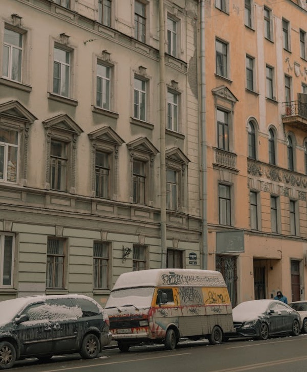
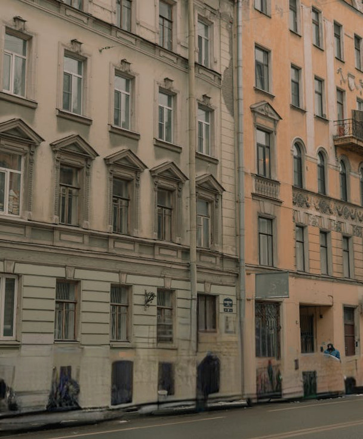
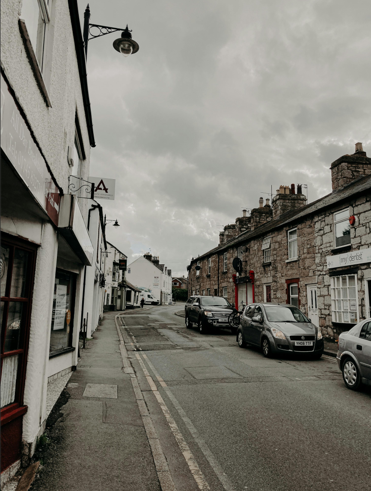
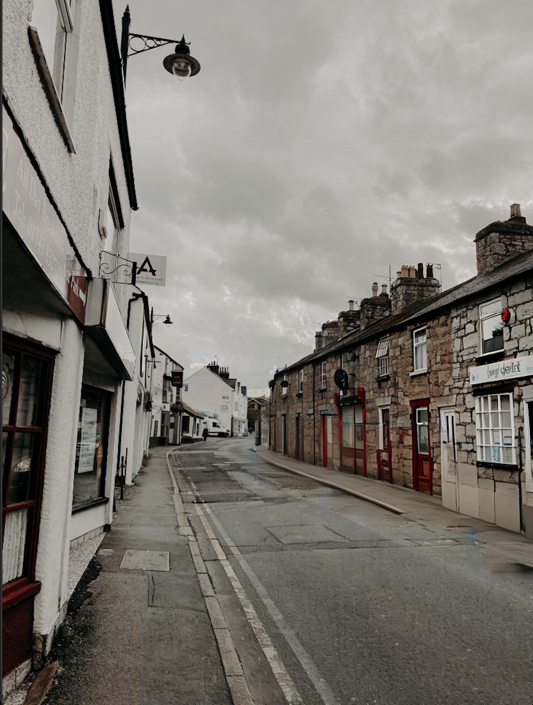
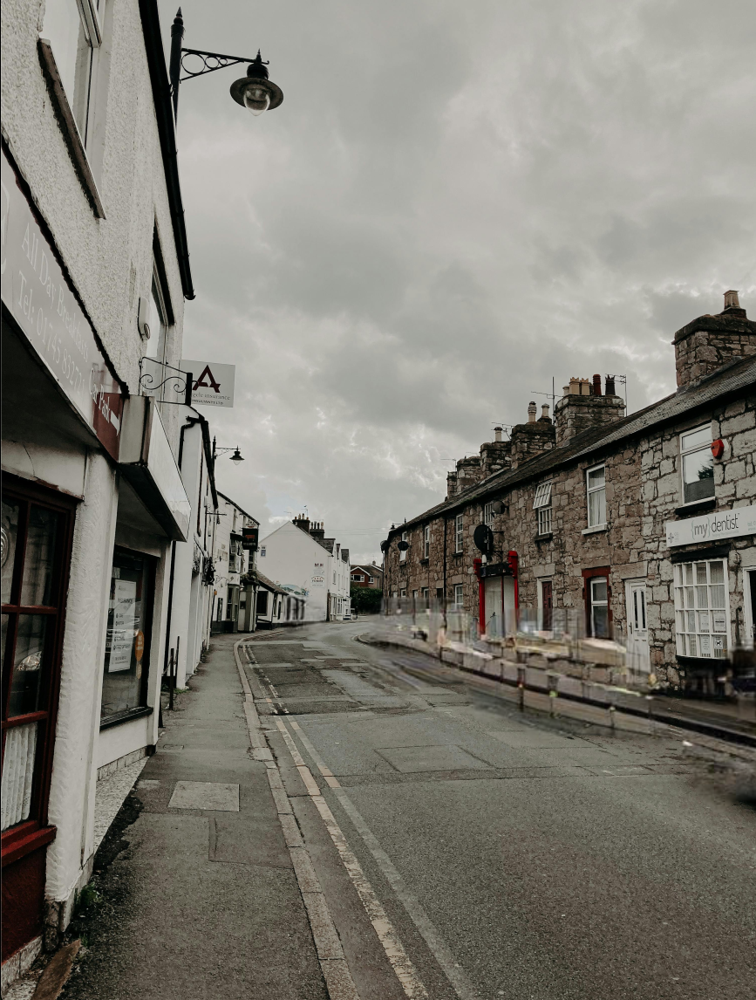

# AutoKorrektur - Inpainting on mobile devices

<p align="center">
<table>
  <tr>
    <td></td>
    <td></td>
  </tr>
</table>
</p>

This project is a webapplication developed as part of a Bachelor Thesis. The application detects and removes cars from images by using inpainting. All processing is done locally in the user's browser. The Evaluation part of the thesis with scripts, data and plots can be accessed [here](https://github.com/BenB2/AutoKorrekturEval).
## Description

The primary goal of this application is to investigate the feasibility and performance of using local device resources, particularly on mobile devices, for a complete image manipulation pipeline. This pipeline includes object detection (cars), segmentation, and inpainting to seamlessly remove the detected objects from an image. As a specific example, this project focuses on removing cars from pictures. The motivation for this specific use-case is to offer an accessible tool for visualizing urban environments with fewer cars. By enabling users to easily create these "after" images, the application aims to support initiatives advocating for sustainable urban development and help residents envision the positive impacts of reduced car dependency, particularly by providing a more readily available means for initial conceptualization compared to traditional design processes.

The application builds upon concepts from the Bachelor Thesis "Autokorrektur - Automatisierte Objektersetzung in Fotos" by Till Schellscheidt, re-implementing and extending them with a focus on client-side execution in the browser.

While the image quality of the results may be lower compared to other approaches, this method achieves results on mobile devices in less than 5 seconds. The following images provide a visual comparison for one such example:
<p align="center">
<table>
  <tr>
    <td></td>
    <td></td>
    <td></td>
  </tr>
  <tr>
    <td align="center" style="font-size: smaller;">Original Image</td>
    <td align="center" style="font-size: smaller;">Alternative Method (Schellscheidt)</td>
    <td align="center" style="font-size: smaller;">This Application's Result</td>
  </tr>
</table>
</p>

## Technologies Used

*   **Frontend:** HTML, CSS, JavaScript
*   **Deep Learning Inference:**
    *   [ONNX Runtime Web](https://onnxruntime.ai/docs/api/js/) with WASM backend
*   **Computer Vision Library:** [OpenCV.js](https://docs.opencv.org/4.x/d5/d10/tutorial_js_root.html)
*   **Models:**
    *   Instance Segmentation: **YOLOv11-seg** (various sizes: n, s, m) (implementation inspired by [YOLOv8-seg ONNX Web Demo](https://github.com/Hyuto/yolov8-seg-onnxruntime-web) and [YOLOv8-segmentation-js](https://github.com/akbartus/Yolov8-Segmentation-on-Browser))
    *   Inpainting: **MI-GAN** (512x512 resolution model) (implementation inspired by [Inpaint-Web](https://github.com/lxfater/inpaint-web))

## Features

*   **Local Image Processing:** All operations (car detection, segmentation, inpainting) are performed in the browser.
*   **Car Detection and Segmentation:** Uses YOLOv11-seg models to identify and create masks for cars.
*   **Inpainting:** Employs the MI-GAN model to fill the masked areas, reconstructing the background.
*   **Model Selection:** Users can choose between different sizes of the YOLOv11-seg model (nano, small, medium) to balance speed and accuracy.
*   **Adjustable Parameters:**
    *   Mask upscaling and extension 
    *   Score threshold for detection
    *   Input image resolution capping (e.g. initial 2MP limit on Smartphones)
    * Batch Processing: Option to process multiple images sequentially. 
    * Evaluation Mode: Option to save masks and runtime data for evaluation purposes.
    * Iterative Processing: Option to use the output of one pass as the input for the next.

## Setup and Usage
        

* Try the demo at [BenB2.github.io](https://benb2.github.io/AutoKorrektur/)

OR

1.  Clone / Download the repository:

2.  Navigate to the `AutoKorrektur` directory:
    ```bash
    cd <repo-name>/AutoKorrektur
    ```

3. Start a local web server:
    ```bash
    python3 -m http.server
    ```
    
4.  Open `localhost:8000` in a web browser that supports WebAssembly.
    *   The application will fetch the necessary ONNX models on the first load.
5.  Use the interface to:
    *   Upload an image.
    *   Adjust settings (optional).
    *   Start the processing.
    *   View and download the result.

## License

The licensing of this project is governed by the licenses of some components.

*   **YOLOv11-seg:** Licensed under GNU AGPLv3. You must comply with its terms, which may require this entire project to be licensed similarly.


Therefore this Project is licensed under the GNU AGPLv3 License. 
## Project Structure

```
.
├── README.md           # This file
├── AutoKorrektur/      # Main application folder
│   ├── icon.png            # Application icon
│   ├── index.html          # Entry point of the web application
│   ├── css/                # Stylesheets
│   │   ├── style.css
│   │   └── font-awesome/   # Font Awesome icons
│   ├── js/                 # JavaScript files including application logic and ONNX runtime
│   │   ├── app.js
│   │   ├── miGanInference.js
│   │   ├── processInput.js
│   │   ├── yoloInference.js
│   │   ├── opencv.js
│   │   └── ort20/          # ONNX Runtime Web files
│   └── model/              # ONNX model files
└── media/                # Media files for README
    └── ...
```
